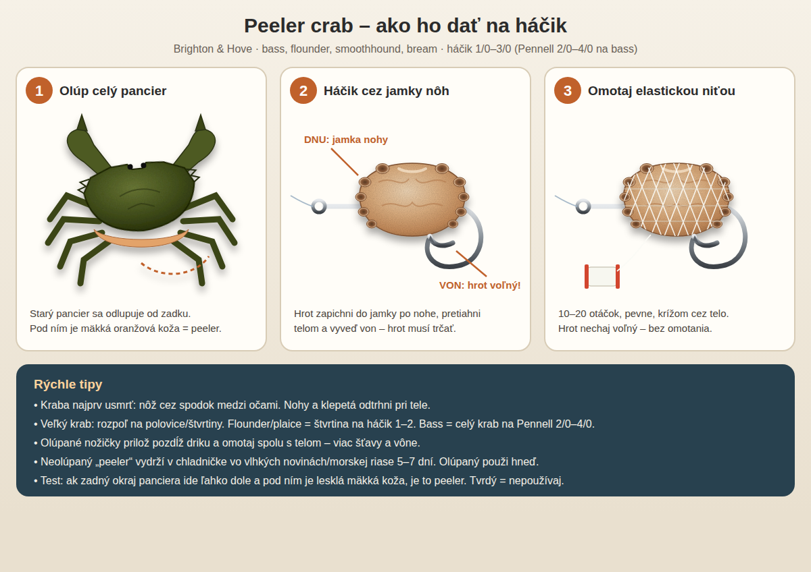

# Peeler crab – ako ho dať na háčik

Najlepšia návnada pri Brighton & Hove na **bass, flounder, smoothhound, bream a wrasse** (apríl–október, špičkovo máj–jún a september).

## Postup
1. **Usmrť kraba** – ostrý nôž cez spodok medzi očami.
2. **Odtrhni nohy a klepetá** tesne pri tele. Nohy si odlož.
3. **Olúp pancier** – začni od zadného okraja, zdvihni vrchný štít, potom spodné platničky a pancier z nožičiek. Pod ním musí byť mäkká, lesklá koža.
4. **Veľkosť kúska** – malý krab celý; veľký rozpoľ na polovice/štvrtiny.
5. **Háčik** – hrot zapichni do jamky po nohe, pretiahni telom a vyveď von tak, aby **hrot a zálomok trčali voľne**.
6. **Omotaj elastickou niťou** (bait elastic) 10–20 otáčok krížom cez telo, pevne. Olúpané nožičky prilož pozdĺž driku a omotaj spolu.

## Háčiky
| Ryba | Háčik | Návnada |
|---|---|---|
| Flounder / plaice | 1–2 (dlhý drik) | štvrtina kraba |
| Bream / wrasse | 1–1/0 | polovica / štvrtina |
| Smoothhound | 2/0–3/0 | 1–2 celé kraby |
| Bass | Pennell 2/0–4/0 | celý krab (aj 2) |

## Skladovanie
- Neolúpané peelery: chladnička (4–8 °C), vlhké noviny alebo morská riasa, 5–7 dní. Denne skontroluj, mŕtve vyhoď.
- Olúpaného kraba použi hneď – rýchlo stráca šťavu.
- Zvyšky na konci dňa zamraz jednotlivo v potravinovej fólii (horšie ako čerstvé, ale fungujú).
